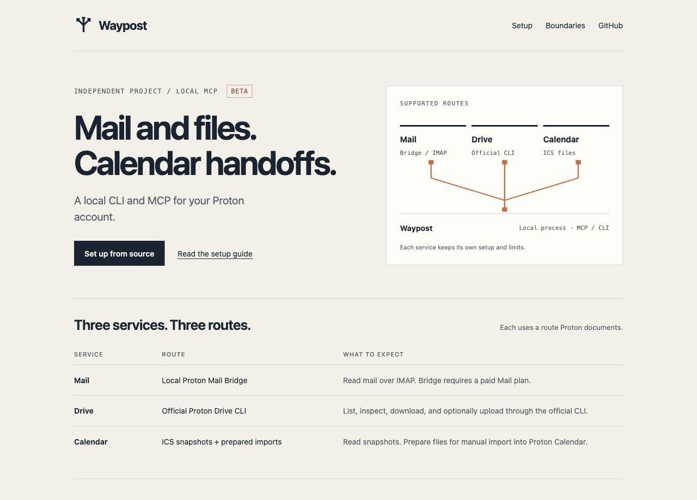

Local tools for **Proton Mail, Drive, and Calendar**, shared by a CLI and an MCP server. Built for agents working on your computer.

Built with TypeScript and Node.js.

[Get started](#get-started) · [Setup](docs/setup.md) · [Proton support](docs/proton-support.md) · [Security](SECURITY.md)

| Service | Connection | What works |
| --- | --- | --- |
| Mail | Proton Mail Bridge, or an authenticated read-only helper | List folders and labels, search and page headers, read messages and threads, save attachments, prepare drafts, optionally send. |
| Drive | Official Proton Drive CLI | List, inspect, download with a checksum check, optionally upload. |
| Calendar | ICS exports or refreshable Proton links | Read an agenda with local times, and prepare import files (timed, all-day, recurring). |
| Codes | Your Proton Mail, plus forwarded SMS on a Mac | Find the newest one-time sign-in code and fill it in the browser. Off until you turn it on. |

Waypost is an independent project. Your Proton account password stays in Proton’s sign-in screens. Bridge and Drive keep separate sessions; Calendar imports need verification in the app. Read the [supported routes and limits](docs/proton-support.md) before connecting an account.

## Get started

Requires **Node.js 22.14+**. You can explore the CLI and prepare calendar files before connecting any service.

```sh
git clone https://github.com/baney75/waypost.git
cd waypost
npm ci --ignore-scripts
npm run build
node dist/cli.js init
node dist/cli.js tools
```

Connect the services you need. Drive opens Proton’s own browser sign-in:

```sh
node dist/cli.js connect drive
node dist/cli.js connect calendar /absolute/path/to/calendar-export.ics
```

Mail uses Bridge’s public certificate and generated credentials, or an existing authenticated read-only helper. Calendar share links are read from a private file or a Proton Pass item and reused for 10 minutes; Proton may delay changes by up to eight hours. Follow [Setup](docs/setup.md), then run:

```sh
node dist/cli.js doctor
```

Each service reports `ready`, `not_configured`, or `failed`. `ready` identifies the check that passed; a parsed Calendar snapshot does not prove live calendar access.

## Add to an agent

The bundled runtime needs only Node.js. From the `waypost` folder, register it with Claude Code for every project:

```sh
claude mcp add waypost --scope user -- node "$PWD/runtime/waypost.mjs" mcp
claude mcp list
```

`claude mcp list` should show `waypost: ... ✔ Connected`. In a session, ask Claude to run `waypost_status`. If you keep the config somewhere other than `~/.config/waypost/config.json`, run `node dist/cli.js --config /path/to/config.json agent-config claude-code` and paste the command it prints.

For other MCP clients, run `node dist/cli.js agent-config claude` (Claude Desktop JSON), `agent-config cursor`, `agent-config codex` or `agent-config generic`, and paste the result into the client’s MCP settings. A generic stdio entry looks like this:

```json
{
  "mcpServers": {
    "waypost": {
      "command": "node",
      "args": ["/absolute/path/to/waypost/runtime/waypost.mjs", "mcp"]
    }
  }
}
```

Direct Bridge reads `WAYPOST_MAIL_USERNAME` and `WAYPOST_MAIL_PASSWORD` from the environment of the process that starts Waypost. Start your agent under your secret manager, for example `pass-cli run --env-file bridge.references.env -- claude`, so the values never sit in a config file. See [Setup](docs/setup.md#mail). MCP uses standard input/output and opens no network listener.

### Tools

| Tool | What it does |
| --- | --- |
| `waypost_status` | Which services are set up and which writes are allowed. Works before setup. |
| `mail_mailboxes` | Folder and label names (`Folders/…`, `Labels/…`, `All Mail`). |
| `mail_list` | Newest headers first; filter by `from`, `to`, `subject`, `text`, `unseen`, `since`, `before`; page with `beforeUid`. |
| `mail_read` | One message: text (HTML converted to text), threading IDs, attachment list. Long bodies page with `textOffset`. Never marks mail read. |
| `mail_thread` | Messages in the same conversation. |
| `mail_attachment` | Saves one attachment to the local artifacts folder. |
| `mail_draft`, `mail_send` | Prepare a local EML; sending is off by default and needs `confirm: true` per call. |
| `mail_verification_code` | Newest one-time code, never the body. Off by default. |
| `drive_list`, `drive_info`, `drive_download`, `drive_upload` | Drive under `/my-files`; uploads are off by default and need `confirm: true`. |
| `calendar_events`, `calendar_prepare` | Read events in a window; write an ICS file to import. |
| `pass_lookup` | Proton Pass item names and URLs only. |

Errors come back as `{ok:false, error:{code, message}}`, and the message says what to run or change, for example `MAIL_AUTH`, `MAIL_MAILBOX_NOT_FOUND`, `DRIVE_NOT_FOUND` or `CONFIG_MISSING`.

The [Codex plugin](docs/plugin.md) bundles the runtime and a focused agent skill. Install from the pinned release:

```sh
codex plugin marketplace add baney75/waypost --ref v0.3.0
codex plugin add waypost@waypost
```

Service setup is still required after installing the plugin. The GitHub marketplace is separate from OpenAI’s reviewed universal directory.

## Use the CLI

Install locally with `npm install -g .`, or replace `waypost` below with `node runtime/waypost.mjs`.

```sh
waypost drive list --path /my-files
waypost mail mailboxes
waypost mail list --subject invoice --since 2026-09-01 --limit 20
waypost mail read --uid 123
waypost calendar agenda --days 7 --timezone America/Chicago
waypost calendar prepare --summary "Project review" \
  --start 2026-10-05T09:00:00 --end 2026-10-05T09:30:00 --timezone America/Chicago \
  --rrule "FREQ=WEEKLY;COUNT=4"
waypost calendar prepare --summary "Vacation" --start 2026-12-21 --end 2026-12-24 --all-day
```

Use normal flags for terminal work, or retain `--input` JSON for scripts. Repeat array flags such as `--to` for each recipient. Commands return JSON. `waypost tools` lists every input schema; `waypost call <tool> --input '{}'` addresses the same tools as MCP.

Mail and Calendar are read-only by default. Mail sends and Drive uploads start disabled; when enabled in local config, each call must still pass `confirm: true` (`--confirm` on the CLI). A send also requires a prepared EML file and its exact SHA-256. Downloads use a new directory. Waypost exposes no permanent-delete or public-sharing tool.

## Fill verification codes

Waypost can find the sign-in code a site just emailed you and fill it in the browser with one click. A small Chromium extension in [`extension/`](extension) talks to Waypost through the browser’s native messaging, so no port is opened. Codes are given only to the site whose domain matches the sender. It is off until you pair it. See [Verification codes](docs/verification-codes.md) for setup on a Mac and the threat model.

## Maintain

`waypost update` checks GitHub release metadata and never installs code. [Updates](docs/updates.md) explains version pinning, checksums, and rollback.

```sh
npm run verify
```

The tests use synthetic data. They drive the MCP server over stdio against a real IMAP server ([pymap](https://pypi.org/project/pymap/), `pipx install pymap==0.36.7`), and run the extension in Chromium when it is installed. Account-level checks require the configured official services. See [Verification](docs/verification.md) for the release’s observed coverage.

[MIT](LICENSE) · [Privacy](docs/privacy.md) · [Contributing](CONTRIBUTING.md)
