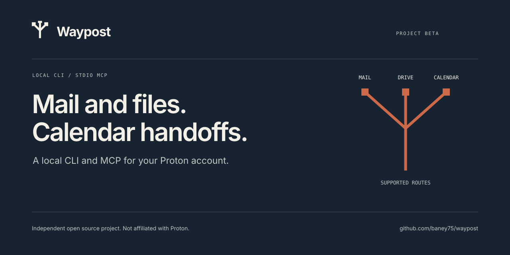

Local tools for **Proton Mail, Drive, and Calendar**, shared by a CLI and an MCP server. Built for agents working on your computer.

[Get started](#get-started) · [Setup](docs/setup.md) · [Proton support](docs/proton-support.md) · [Security](SECURITY.md)

| Service | Connection | What works |
| --- | --- | --- |
| Mail | Proton Mail Bridge · direct or authenticated read-only helper | Read headers and messages, prepare drafts, optionally send. |
| Drive | Official Proton Drive CLI | List, inspect, download, optionally upload. |
| Calendar | ICS exports or refreshable Proton links | Read an agenda and prepare import files. Import in Proton Calendar. |

Waypost is an independent project. Your Proton account password stays in Proton’s sign-in screens. Bridge and Drive keep separate sessions; Calendar imports need verification in the app. Read the [supported routes and limits](docs/proton-support.md) before connecting an account.

## Get started

Requires **Node.js 22.14+**. You can explore the CLI and prepare calendar files before connecting any service.

```sh
git clone https://github.com/baney75/waypost.git
cd waypost
npm ci --ignore-scripts
npm run build
node dist/cli.js init
node dist/cli.js tools
```

Connect the services you need. Drive opens Proton’s own browser sign-in:

```sh
node dist/cli.js connect drive
node dist/cli.js connect calendar /absolute/path/to/calendar-export.ics
```

Mail uses Bridge’s public certificate and generated credentials, or an existing authenticated read-only helper. Calendar share links refresh on each query; Proton may delay changes by up to eight hours. Follow [Setup](docs/setup.md), then run:

```sh
node dist/cli.js doctor
```

Each service reports `ready`, `not_configured`, or `failed`. `ready` identifies the check that passed; a parsed Calendar snapshot does not prove live calendar access.

## Add to an agent

The bundled runtime needs Node.js and has no dependency-install step.

```json
{
  "mcpServers": {
    "waypost": {
      "command": "node",
      "args": ["/absolute/path/to/waypost/runtime/waypost.mjs", "mcp"]
    }
  }
}
```

For a Codex TOML entry, run `node dist/cli.js agent-config codex`. For Cursor or Claude, run `node dist/cli.js agent-config generic` and copy the JSON output. MCP uses standard input/output and opens no network listener.

The [Codex plugin](docs/plugin.md) bundles the runtime and a focused agent skill. Install from the pinned release:

```sh
codex plugin marketplace add baney75/waypost --ref v0.2.0
codex plugin add waypost@waypost
```

Service setup is still required after installing the plugin. The GitHub marketplace is separate from OpenAI’s reviewed universal directory.

## Use the CLI

Install locally with `npm install -g .`, or replace `waypost` below with `node runtime/waypost.mjs`.

```sh
waypost drive list --path /my-files
waypost mail list --mailbox INBOX --limit 5
waypost calendar agenda --days 7
waypost calendar prepare --summary "Project review" \
  --start 2026-10-05T14:00:00Z --end 2026-10-05T14:30:00Z
```

Use normal flags for terminal work, or retain `--input` JSON for scripts. Repeat array flags such as `--to` for each recipient. Commands return JSON. `waypost tools` lists every input schema; `waypost call <tool> --input '{}'` addresses the same tools as MCP.

Mail sends and Drive uploads start disabled. A send requires a prepared EML file and its exact SHA-256. Downloads use a new directory. Waypost exposes no permanent-delete or public-sharing tool.

## Maintain

`waypost update` checks GitHub release metadata and never installs code. [Updates](docs/updates.md) explains version pinning, checksums, and rollback.

```sh
npm run verify
```

The tests cover CLI/MCP negotiation, policy failures, file boundaries, mail transport, and calendar parsing using synthetic data. Account-level checks require the configured official services. See [Verification](docs/verification.md) for the release’s observed coverage.

[MIT](LICENSE) · [Privacy](docs/privacy.md) · [Contributing](CONTRIBUTING.md)
